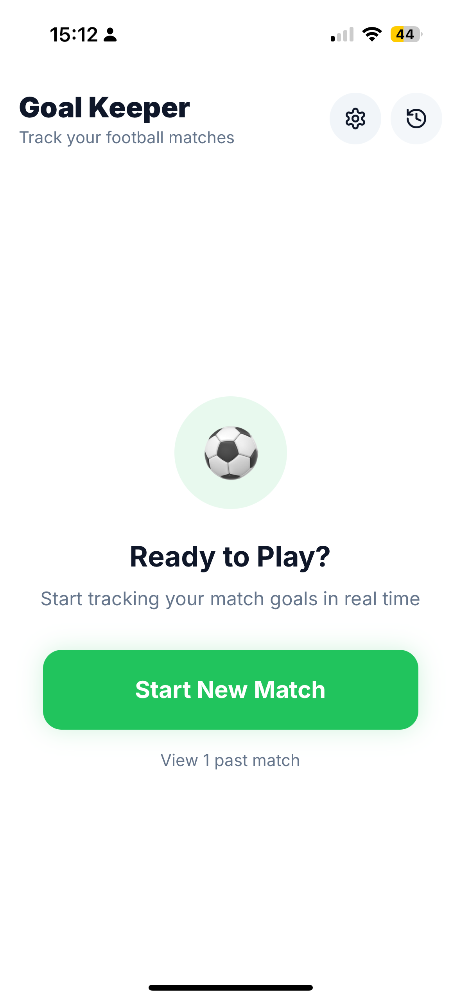
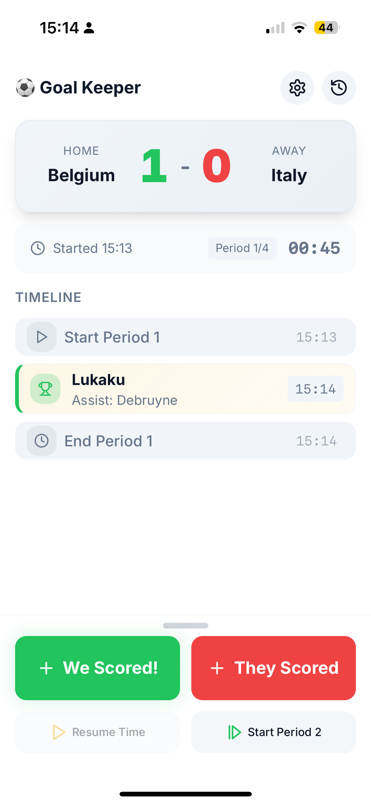
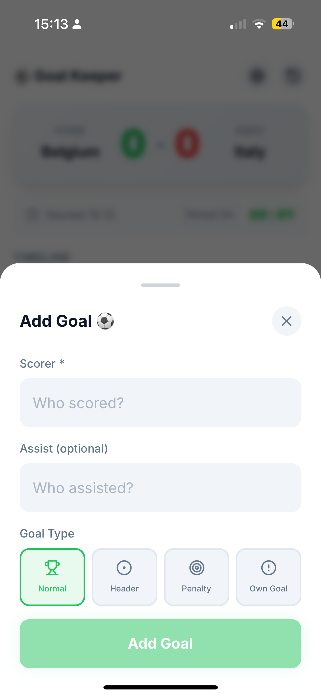
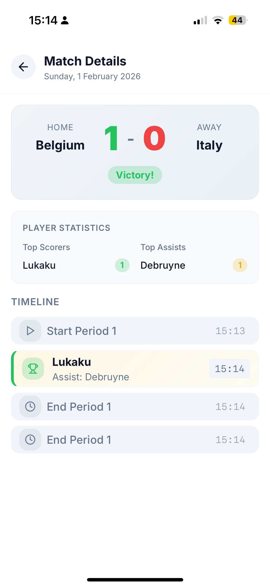

# ⚽ Goal Keeper

A Progressive Web App (PWA) for tracking football match goals and events in real-time. 
Ideal for parents, who want to keep track of the goals during their kids matches.

## Screenshots

| Home Screen | Live Match | Match Score | Match History |
|-------------|------------|---------------|---------------|
|  |  |  |  |

## Features

### Core Functionality
- **Live Match Tracking**: Record goals and events during matches with real-time scoring
- **Goal Types**: Support for normal goals, penalties, own goals, and headers
- **Player Management**: Track scorers and assists with autocomplete from your player list
- **Match Timer**: Period-based timing with pause/resume functionality
- **Timeline View**: Chronological view of all goals and match events
- **Match History**: View and manage past matches with detailed statistics
- **Player Statistics**: See top scorers and assist leaders for each match

### Match Configuration
- Customizable match format (1-6 periods)
- Flexible period duration (10-45 minutes)
- Home/Away team designation
- Custom team names

### Progressive Web App
- iOS home screen installation support
- Optimized for standalone mode (no browser UI)
- Proper viewport height handling for iOS PWA
- Works offline after initial load
- Native app-like experience

### Settings & Customization
- **Team Management**: Set your team name
- **Player Database**: Maintain a list of players for quick goal entry
- **Theme Support**: Light, Dark, and System themes
- **Cloud Sync**: Sync matches across devices using Cloudflare KV (token required)
- **Debug Mode**: Viewport debugging overlay for development

## Technology Stack

- **Framework**: React 18 with TypeScript
- **Build Tool**: Vite
- **Styling**: Tailwind CSS
- **Icons**: Lucide React
- **Routing**: React Router v6
- **State Management**: React Hooks (Custom hooks for matches, settings, sync)
- **Storage**: LocalStorage for persistence
- **Cloud Sync**: Cloudflare KV (optional)
- **UI Components**: Radix UI primitives

## Installation

### Prerequisites
- Node.js 18+ and npm

### Setup

1. Clone the repository:
```bash
cd goal-keeper
```

2. Install dependencies:
```bash
npm install
```

3. Start the development server:
```bash
npm run dev
```

To run the app with Cloudflare Pages Functions locally, use Wrangler:

```bash
npm run dev:pages
```

This serves the built app and the `functions/` directory locally. Changes to
the frontend or functions require restarting the command because the app is
built into `dist` before Wrangler starts.

### Cloud Sync and View-only Sharing

The app uses one Cloudflare Pages deployment and one `GOALKEEPER_KV` namespace
for both editors and viewers. Configure `AUTH_TOKEN` and `VIEWER_TOKEN` as
secrets for the Pages Functions environment. They must be different values.
The editor token can read and write the shared workspace. The viewer token can
read it, while the server rejects viewer writes. Shared links contain the
viewer token in the URL fragment, which is not sent with HTTP requests.

Viewer responses also include the configured public calendar URL and team name
so viewers can read upcoming fixtures. The URL is disclosed to viewers, so only
use a public calendar subscription. Calendar settings remain editor-only, and
viewer fixture rows cannot start or change matches. Refreshing fixtures reads
through `/api/calendar` and never writes workspace state to `/api/state`.

Set both secrets before deploying the sharing UI. The app does not provide a
second data store or deployment for viewers. If the viewer secret is missing
or matches the editor secret, the share endpoint stays unavailable and existing
editor sync continues to use the same KV data.

Legacy `settings.syncToken` values are omitted from every API response. They are
removed from the stored workspace the next time an editor writes state. This
change does not run a direct migration against production KV data.

To revoke viewer links, replace `VIEWER_TOKEN` with a new random value in the
Pages environment and deploy the updated secret. Previously copied links then
stop authenticating. Copy a new **Share link** from Settings. When rotating both
credentials, update both secrets as one deployment so the app never runs with
matching values. Editors can replace their saved token in Settings on each
device. The sync status there shows the last successful refresh time.

4. Build for production:
```bash
npm run build
```

## Usage

### Starting a Match

1. Tap "Start New Match" on the home screen
2. Enter your team name and opponent name
3. Select Home or Away
4. Tap "Start Match"

### During a Match

- **Start Period**: Begin timing a period
- **Add Goal**: Record goals for your team with optional scorer, assist, and goal type
- **Opponent Goal**: Quickly record opponent goals
- **Add Event**: Add match events (pause, resume, period end)
- **End Period**: Mark the end of a period
- **Undo**: Remove the last goal or event
- **End Match**: Complete the match and save to history

### Match History

- View all completed matches
- See scores, dates, and match results
- Tap a match to see detailed timeline and statistics
- Delete matches by tapping the trash icon

### Settings

- **Team Name**: Set your default team name
- **Players**: Add players to your roster for autocomplete
- **Match Format**: Configure periods and duration
- **Appearance**: Choose light, dark, or system theme
- **Cloud Sync**: Enter a token to sync across devices
- **Debug Mode**: Enable viewport debugging overlay

## iOS PWA Installation

1. Open the app in Safari
2. Tap the Share button
3. Scroll down and tap "Add to Home Screen"
4. Tap "Add"
5. Launch from your home screen for full-screen experience

The app includes special viewport handling to ensure proper display in iOS standalone mode, eliminating white space issues common in iOS PWAs.

## Development

### Project Structure

```
src/
├── components/          # React components
│   ├── LiveMatchLayout.tsx    # Main live match layout with viewport handling
│   ├── MatchActions.tsx       # Action buttons during match
│   ├── Scoreboard.tsx         # Score display
│   ├── GoalTimeline.tsx       # Timeline of goals/events
│   ├── MatchHistory.tsx       # Match history list
│   ├── MatchDetail.tsx        # Match detail view with statistics
│   ├── SettingsScreen.tsx     # Settings interface
│   └── ...
├── hooks/               # Custom React hooks
│   ├── useMatches.ts          # Match state management
│   ├── useSettings.ts         # Settings persistence
│   ├── useSync.ts             # Cloud sync logic
│   └── useTheme.ts            # Theme management
├── lib/                 # Utilities and libraries
│   └── sync.ts                # Cloudflare KV sync implementation
├── types/               # TypeScript type definitions
│   └── match.ts               # Match, Goal, Event types
├── pages/               # Page components
│   └── Index.tsx              # Main app page
├── main.tsx             # Entry point with iOS viewport fix
└── index.css            # Global styles and theme variables
```

### Key Technical Details

#### iOS PWA Viewport Fix
The app implements multiple timing strategies in `main.tsx` to handle iOS PWA viewport expansion:
- Immediate calculation on load
- Delayed calculations (100ms, 500ms) for PWA launch
- Event listeners for resize, orientation change, visibility change
- Custom CSS variable `--vh` for accurate viewport height

#### Theme System
Three theme modes using CSS custom properties:
- Light theme
- Dark theme
- System theme (follows OS preference)

#### Data Persistence
- Match history and settings stored in localStorage
- Optional cloud sync via Cloudflare KV
- Automatic save on state changes

## License

MIT

## Author

Built for tracking football matches with friends and family.
